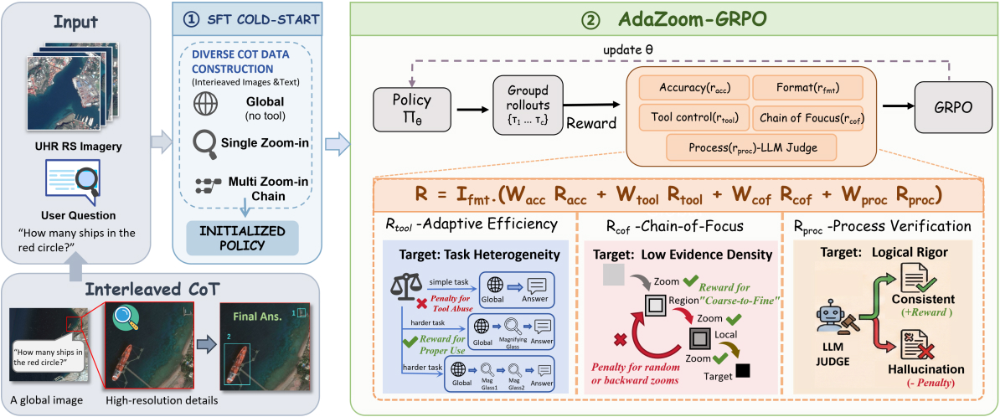
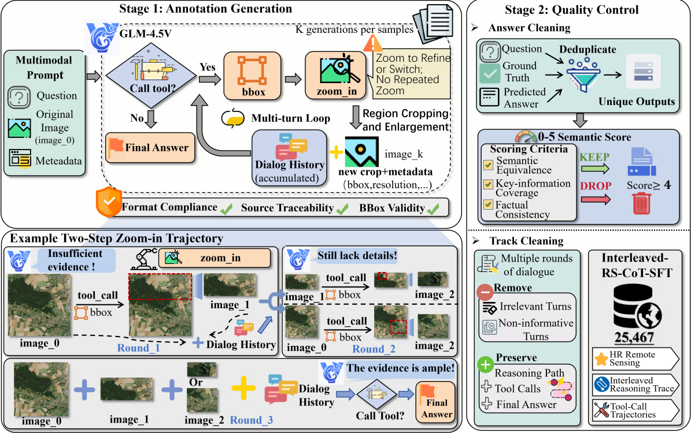
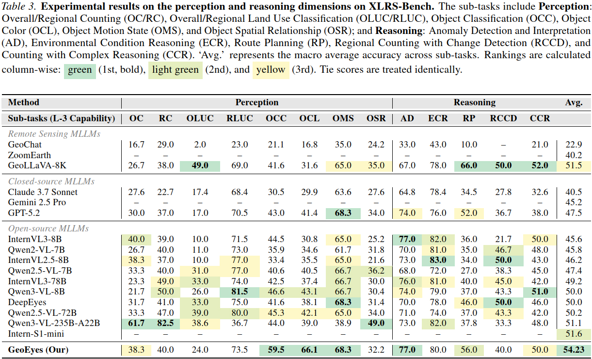

<div align="center">
  <h2><strong>GeoEyes: On-Demand Visual Focusing for Evidence-Grounded Understanding of Ultra-High-Resolution Remote Sensing Imagery</strong></h2>
  <h5>
  Anonymous Authors
      <br/><br/>
  </h5>
</div>

## 📚 Contents

- [📚Contents](#-contents)
- [🔍Overview](#overview)
- [🌐UHR-CoZ Dataset](#uhr-coz-dataset)
- [🛠️Methodology & Training](#methodology--training)
- [🚀Evaluation](#evaluation)

## 🔍Overview



<p align="center"><strong>Fig 1. Overview of the AdaZoom-GRPO Framework.</strong></p>

We introduce **GeoEyes**, a specialized MLLM for Ultra-High-Resolution (UHR) Remote Sensing. Current "thinking-with-images" models suffer from **Tool Usage Homogenization**—collapsing into rigid, one-size-fits-all zooming patterns that fail to address the task heterogeneity and low evidence density of UHR imagery.

To solve this, we propose a staged training framework:
1.  **Cold-Start SFT**: Initializing the model with **UHR-CoZ**, a dataset containing diverse "Chain-of-Zoom" trajectories (Global, Single-Zoom, Multi-Step).
2.  **AdaZoom-GRPO**: An Agentic Reinforcement Learning stage with a novel reward system designed to incentivize **on-demand zooming** and **progressive focusing**.

Our method achieves **54.23% accuracy on XLRS-Bench**, establishing a new state-of-the-art by outperforming larger models like Qwen2.5-VL-72B and domain-specific agents like DeepEyes.

## 🌐UHR-CoZ Dataset

We construct **UHR Chain-of-Zoom (UHR-CoZ)**, the first large-scale interleaved image-text chain-of-thought dataset specifically for UHR remote sensing. It is built using an automated agentic pipeline (Fig 2) involving **GLM-4.5V**, which generates multi-round zoom-in trajectories cleaned by a semantic scorer.



<p align="center"><strong>Fig 2. Automated data construction pipeline for UHR-CoZ.</strong></p>

### Dataset Statistics

| Statistic                          | Value         |
| :--------------------------------- | :------------ |
| **Total Samples**                  | **25,467**    |
| Avg. Image Resolution              | 2,178 × 2,051 |
| Zoom-in Depth (No Zoom)            | 6.4%          |
| Zoom-in Depth (One Zoom)           | 86.7%         |
| Zoom-in Depth (Multi-Step $\ge 3$) | 6.9%          |
| Avg. Reasoning Length              | 157.8 tokens  |

## 🛠️Methodology & Training

Our approach builds upon the **DeepEyes** framework, introducing a two-stage optimization process.

### 1. Prepare Data

* **UHR-CoZ**: Download our constructed SFT dataset with interleaved zoom trajectories.
* **SuperRS-VQA**: Used during the RL stage to enhance task diversity.
* **General RL Data**: We utilize DeepEyes-47K for general reasoning stability.

**Anonymous Dataset URL**: https://huggingface.co/datasets/Anonymous-BdjkruUUIg/UHR-CoZ

### 2. Training Stages

The code base is develeped using torch2.6/2.8+cu128 and Python3.10/3.11.

#### Stage 1: Cold-Start SFT
We perform Supervised Fine-Tuning on UHR-CoZ to initialize the policy with basic tool capabilities and stop-conditions.

```bash
# 1. We use LLaMA-Factory for SFT please first install llamafactory, following
# https://github.com/hiyouga/LlamaFactory/tree/2a822178dea4d1c05f595521dd883a8e4f4e2e77
# 2. Ensure dataset_info.json is updated with UHR-CoZ paths
# 3. start training
llamafactory-cli train config.yaml
```

#### Stage 2: AdaZoom-GRPO (Agentic RL)

We optimize the model using **Group Relative Policy Optimization (GRPO)** with our specific reward formulation:

* **Adaptive Efficiency Reward** (Penalizes redundant tools on easy tasks).
* **Chain-of-Focus Reward** (Geometric containment reward for progressive zoom).
* **Necessity-Aware Process Verification** (LLM-based judge for logical rigor).

```bash
# 1. Train using the DeepEyes-based RLVR framework, please first install DeepEyes, following https://github.com/Visual-Agent/DeepEyes
# we also provided a clean requirements.txt without torch package
# 2. download RL data, and modify parquet file paths in the training script/yaml file
# 3. follow deepeyes to set LLM judge and start training using
export LLM_AS_A_JUDGE_BASE="http://{IP}:{PORT}/v1"
python -m verl.trainer.main_ppo \
    --config-path DeepEyes/config \
    --config-name deepeyes_coz
```

## 🚀Evaluation

We evaluate on **XLRS-Bench**, focusing on Perception (e.g., Counting, Object Classification) and Reasoning (e.g., Route Planning, Anomaly Detection) tasks.

### Running Evaluation

```bash
# 1. frist prepare data using the provided notebook
# 2. convert model from pt format to hf model
bash s1.sh
# 3. deploy model using vllm (or ray using `serve run ray.yaml`)
bash s21.sh
# 4. prompting vllm, this may take 1~2 days considering different GPU types
bash s22.sh
# 5. calculate accuracy metrics
bash s232.sh
# 6. analyze tool call statistics
bash s233.sh
```

We provide our trained model checkpoints through **anonymous** repo: https://huggingface.co/Anonymous-BdjkruUUIg/GeoEyes

### Main Results (XLRS-Bench)



